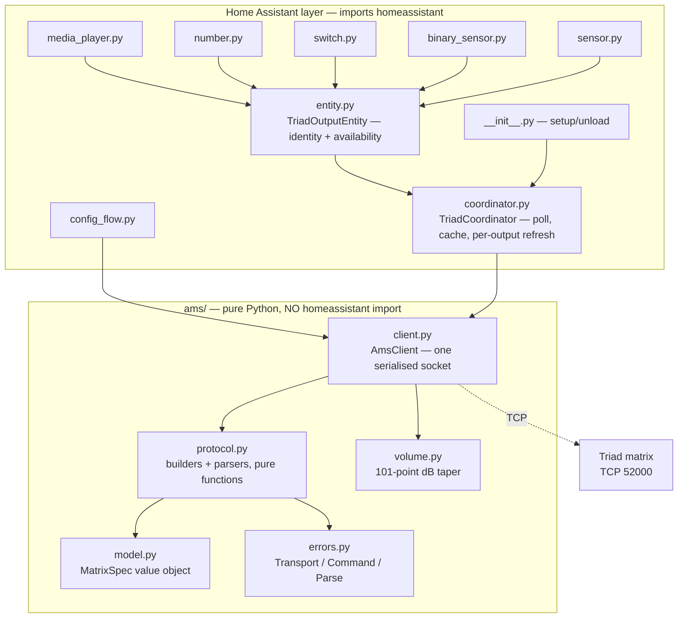

# System Design & Architecture

Requirements: [`../requirements/2026-08-28-feature-triad-ams-integration.md`](../requirements/2026-08-28-feature-triad-ams-integration.md).
Protocol reference: [`../../triad-ams-protocol.md`](../../triad-ams-protocol.md).

## Architecture Overview

Four layers, each depending only on the one below. The boundary that matters most is between
`ams/` and everything above it: **`ams/` must not import Home Assistant.** That is not a style
preference — Home Assistant cannot be imported on Windows (C-06), so this boundary is the only
reason the protocol and client are testable during development at all. `tests/conftest.py`
enforces it structurally by importing `ams` as a top-level package; adding an HA import stops the
suite collecting rather than letting it pass on a technicality.



**One config entry per matrix**, each with its own client, socket and coordinator. Nothing is
shared between matrices, which is what satisfies NFR-03: one unreachable matrix cannot stall the
other two because they have no common resource to block on.

## Data Models

### `MatrixSpec` — the model as a value object

```python
@dataclass(frozen=True, slots=True)
class MatrixSpec:
    name: str  # "AMS8" | "AMS16" | "AMS24"
    outputs: int
    inputs: int
```

**This replaces threading `output_count=` and `input_count=` through every protocol call.** The
current code passes both as keyword arguments to roughly forty functions, each re-validating the
range independently — scattered validation and a missing domain concept, in the terms of the
design review checklist. `MatrixSpec` carries them together, validates once, and gives the two
numbers a name.

It also removes a live trap. The ASG trigger opcode depends on the model — an 8×8 has no 9–16
bank, so ASG reuses that index — and today that is a bare `output_count <= 8` test at the call
site. On a `MatrixSpec` it becomes `spec.asg_index`, defined once.

### `OutputSnapshot` — what one poll learned

```python
@dataclass(frozen=True, slots=True)
class OutputSnapshot:
    source: int | None  # 1-based input, None = Audio Off
    volume_step: int  # 0..100
    muted: bool
    # Populated only when a consumer is enabled — see "Tiered polling"
    tone: ToneSnapshot | None = None
```

`source is None` **is** the off state. There is no separate per-output power concept in the
hardware, and inventing one would mean holding a flag that the device cannot confirm.

### Tiered polling

The DSP entities are disabled by default, so polling their values on every cycle would spend ~20
extra round trips per output to populate entities nobody enabled — 480 on a 24×24, against
NFR-01's requirement that a cycle fit inside its interval.

**The coordinator polls the core three attributes always, and tone/EQ only when at least one
entity consuming them is enabled.** Entities register their need at `async_added_to_hass`. This
is the one piece of coupling from entities back to the coordinator, and it is deliberate: the
alternative is either a slow poll for everyone or per-entity polling, which would break the
single-socket serialisation guarantee.

### Audio sense — designed from measurement, 2026-08-29

The 2026-08-29 capture settled what the values mean, and one of them changes the entity design.

| Device value | Meaning | Entity state |
|---|---|---|
| `1` | Signal present | `on` |
| `0` | No signal | `off` |
| `2` | **The matrix is not measuring** — audio sense is disabled | **`unavailable`** |

**`2` must not map to `off`.** `off` asserts "there is no audio", which the device has not
determined and cannot; an input carrying music reads `2` exactly like a dead one. `unavailable` is
the honest state for "this sensor is not running", and it is also actionable — an entity that is
unavailable prompts the question that leads to the setting, where a confident `off` does not.

That makes the value a three-state, so `parse_audio_sense` returns `bool | None` rather than
`bool`, and `None` propagates to `unavailable`.

**A per-matrix diagnostic answers the obvious follow-up.** If 24 inputs go unavailable at once,
the user needs to know why. A `binary_sensor` per matrix reporting whether audio sense is enabled
supplies it directly, rather than leaving them to infer it.

**Polling is per-input and tiered**, on the same principle as D-10: inputs are only polled when at
least one audio-sense entity is enabled. Disabled entities are never added to Home Assistant, so
they never register a need, and a setup with the platform untouched costs nothing on the wire.

**The enable command — withheld under coexistence, exposed as FR-14.** *(Reversed 2026-08-29.)*

Two reasons were given for withholding it. The decisive one has gone:

1. ~~**Control4 re-asserts the setting on every sync**~~ — `SyncStateToDevice` ends with
   `disableAudioSense(g_arielData.disableAudioSense)`, so a switch would appear to work and
   silently revert on the next reconnect. **This was the real reason, and it dies with Control4.**
   With a single writer the setting is durable, and a control that holds is a control worth having.
2. It returns a **burst of ~one frame per input** (C-09). This survives — but it is a framing
   problem with a known fix, not grounds for withholding a control.

**Designing for the burst.** `AmsClient` gains an explicit bursty-write path: send, then read
frames until the socket has been quiet for the drain timeout, and discard all of them.

The count is *approximately* one per input, and **must not be assumed to be exactly that**. C-09
measured "roughly one frame per input", and a client that reads exactly `spec.inputs` frames
desyncs by one for as long as the connection lives if the firmware sends one more or one fewer.
Quiet-socket is the only safe terminator, and it is the same primitive D-03's learned framing
already relies on.

This is the only command whose reply is a burst, so it is a **named method** (`send_bursty`)
rather than a flag on the normal write path. A flag would put burst handling in the hot path of
every write to serve one command — and would make the expensive quiet-socket wait the default.

The off-delay setter, also FR-14, is an ordinary single-response write and needs none of this.

**One consequence outside this layer.** The `audio_sense_disabled` repair issue currently tells the
user to fix the setting in the Control4 driver, and warns that changing it on the device will not
last. Both halves become wrong once Control4 is gone: the fix is the new switch, and the device
value is now durable. `repairs.py` and `strings.json` must change with this, or the integration
will be advising users to configure software they have removed.

## Replacement design — FR-12…FR-17

*(Added 2026-08-29.)* Three of these replace a Control4 behaviour that would otherwise be lost;
three are unblocked by Control4's removal rather than caused by it.

### FR-12 — turn-on volume tracking

**The option decides which entity exists.** `track_turn_on_volume` per entry, default **on**.
When on, a diagnostic `sensor` shows the value; when off, a writable `number` owns it.

This replaces the phrasing carried out of requirements — "the entity is read-only while tracking"
— which was a **synchronised flag**: a setting in one place silently changing an entity's
behaviour in another. Home Assistant has no read-only `number` anyway, so it would have meant
raising on write or swapping platforms. Entity presence following an option is a pattern
`active_outputs` already uses, and the entry already reloads on options change.

**Mechanism.** After a volume write settles, write that output's volume into the turn-on register.
Per-output `Debouncer` at 10 s, matching the driver's `SetTurnOnVolume`.

**Write the re-read value, not the value sent.** D-08 re-reads after every write because the device
caps volume against its own max-volume register. Storing the *sent* step would persist a volume the
device never adopted — precisely the error D-08 exists to prevent, and it would surface a fortnight
later as a zone that turns on louder than it can go.

### FR-13 — routing debounce

Per-output `homeassistant.helpers.debounce.Debouncer`, cooldown 0.25 s, wrapping the write **and
its re-read**.

**`immediate=True` — corrected during implementation.** The design originally specified
`immediate=False`, matching the Control4 driver's trailing debounce. CI caught what that means
here: `select_source` returned before the write reached the device, so a caller checking state
straight afterwards read the old source. Two `media_player` tests failed on exactly that, and they
were right to.

The trailing edge is correct for Control4 because its UI streams a route command per scroll step.
Home Assistant's `select_source` is a discrete choice, so there is nothing to wait for, and
delaying it turns a synchronous operation asynchronous for no benefit.

Leading gives both halves: the first call is **awaited**, so its failure still raises at whoever
asked, while a runaway automation is still coalesced into one trailing run. Verified against Home
Assistant's `Debouncer` source rather than assumed — `async_call` awaits the job and lets
exceptions propagate, and only `_handle_timer_finish` catches and logs. That asymmetry is the
right way round: the trailing run has no caller left to raise at.

**It must wrap the pair, not sit inside `AmsClient.set_route`.** A debounce in the client returns
before the write reaches the device, so D-08's re-read would read state the write had not yet
changed — a silent inversion of the ordering D-08 depends on.

**Honest scope:** this is worth less here than in Control4. C4's UI can emit a route command per
scroll step; Home Assistant's `select_source` is a discrete selection. This is insurance against a
looping automation, not a fix for observed behaviour. Recorded so nobody later mistakes it for
evidence of a problem that was measured.

### FR-15 — max volume enforcement *(amended during design review)*

FR-15 asked for "max volume as an entity". **The value already has a home** — the
`output_max_volumes` option — and a second one would be two sources of truth for one setting. So
no new entity.

Instead the existing option is projected onto **two enforcement points**:

| Point | Effect | Status |
|---|---|---|
| `media_player` slider scale (`_max_step`) | The cap is the top of the slider | Already built |
| The device's own max-volume register | Hardware refuses to exceed it regardless of sender | New |

**Written on change only, never on connect.** D-05 forbids pushing cached state on connect because
it overwrites device truth with a stale cache. Max volume has no *readable* device truth, so
there is nothing to overwrite and the rule does not engage — but writing it on connect would still
be pushing cached state, so the narrower rule stands.

**Accepted gap:** the register cannot be read, so after a factory reset the device and the stored
option diverge with nothing to detect it.

### FR-16 — EQ presets

`ams/presets.py` holds the 7 generic curves as band tuples — pure data, no Home Assistant import,
unit-testable on Windows like the rest of `ams/`.

Applied by an entity service **`apply_eq_preset` on `media_player`**, not on the EQ entities. A
preset is an output-level operation, and `media_player` is the only entity guaranteed to exist for
an output — every DSP entity is disabled by default, so a service hosted on one would be
unavailable in the default configuration.

**No preset-state entity.** The device stores band values, not a preset identifier. "Current
preset" is derivable by matching five bands against the table, but only when DSP polling is active
for that output, and it is fabricated otherwise. A service is an *action*; actions do not need
state.

**User-defined presets are scripts** that call this service or `set_eq_band`. Home Assistant's own
storage answers the storage question, consistent with the same reasoning applied to audio mode
(scenes) and the 2.1 link (an automation).

### FR-17 — IP address diagnostic

`protocol.query_ip_address` plus a diagnostic `sensor`, disabled by default like every entity
outside `media_player`.

**It must be redacted in diagnostics** alongside the host and MAC. It is the same class of data,
and a diagnostics download is routinely pasted into public issue trackers.

## API Design

### `ams.protocol` — pure functions

Two families, no state:

- **builders** — `set_route(spec, output, source) -> bytes`, `query_output_volume(spec, output) -> bytes`
- **parsers** — `parse_output_volume(text) -> tuple[int, float]`

Every parser returns the **output index the device named** alongside the value. That is not
decoration: it is what lets the client detect a desynchronised stream. If the device answers for
output 3 when asked about output 4, the frame boundary has slipped and the value belongs to
another zone. Returning the bare value would make that failure invisible, and unhandled frame
padding produces exactly it.

Callers speak **1-based** indices throughout; conversion to the wire's 0-based form happens in
the builders and nowhere else.

### `ams.client.AmsClient` — one socket, serialised

| Method group | Contract |
|---|---|
| `connect` / `disconnect` | Lazy connect; explicit close |
| `get_*(output)` | Query, parse, verify index, return value |
| `set_*(output, …)` | Send, consume the response frame, **discard it** |

**Writes deliberately do not parse their response.** The device does answer a write, but the
wording was never captured — the live probe was query-only, because a set command moves audio in
an occupied house. Validating against guessed strings is how a client rejects a command that in
fact succeeded, so callers needing certainty re-read instead. This is a standing decision, not a
gap to fill later.

### Error contract

| Exception | Meaning | Caller does |
|---|---|---|
| `TransportError` | Socket failed | Reconnect; coordinator raises `UpdateFailed` |
| `CommandError` | `Command error` or empty frame on a healthy socket | Retry; **keep the connection** |
| `ParseError` | Response not understood, or index mismatch | Do not retry; log |

The `CommandError` / `TransportError` split is the single most consequential decision in the
client. Real firmware emits both fault forms on healthy sockets; treating them as transport
failures produces a reconnect loop precisely under the load that provoked them.

## Component Breakdown

| Component | Responsibility | Depends on |
|---|---|---|
| `ams/model.py` | `MatrixSpec`; model table; derived indices (ASG, disconnect sentinel) | — |
| `ams/errors.py` | Three-way failure taxonomy | — |
| `ams/protocol.py` | Wire format: builders and parsers | model, errors |
| `ams/volume.py` | dB ↔ step, nearest-match | — |
| `ams/client.py` | Socket, serialisation, learned framing, reconnect | all of `ams/` |
| `coordinator.py` | Poll cadence, snapshot cache, per-output refresh | client |
| `entity.py` | Identity (`unique_id`, device info), availability | coordinator |
| `<platform>.py` | Map snapshots to entity state; map commands to client calls | entity, coordinator |
| `config_flow.py` | Setup and options; probe on add | client, model |

**Single source for the step ceiling.** `MAX_STEP` is currently defined in both `protocol.py`
(as `0x64`) and `volume.py` (as `100`) — the same number in two modules, which is a synchronised
constant waiting to drift. It belongs in `volume.py` alone, since that module owns the scale.

**`_channel_counts` and `_active_outputs` must move out of `__init__.py`.** `media_player.py`
currently imports both as private names from the package root — a leaked internal and an import
cycle risk as platforms multiply. They belong on the entry-derived config object alongside
`MatrixSpec`.

## Design Decisions

| # | Decision | Alternatives rejected | Why |
|---|---|---|---|
| D-01 | `ams/` has no Home Assistant imports | Single flat package | Enforced by C-06; also makes the protocol reusable and independently testable |
| D-02 | One serialised socket per matrix | Connection per command; connection pool | The device has no message IDs, so concurrent commands cannot be matched to answers. Per-command connections also add a handshake to all ~72 round trips of a poll |
| D-03 | Framing learned per connection | Assume single-NUL; assume padded | Both exist in this fleet's own firmware. Assuming either is silently wrong on the other |
| D-04 | Writes discard their response | Parse and validate | The response wording is unmeasured. See "Writes" above |
| D-05 | Poll, never push cached state on connect | Mirror the Control4 driver's `SyncStateToDevice` | **Rationale replaced 2026-08-29, decision unchanged.** The original reason — destructive for a *second* controller — died with coexistence. It survives on stronger ground: the matrix persists its own state, so a push on connect can only overwrite the truth with a stale cache. Worth noting this is where the integration deliberately differs from the driver it replaces, and it now does so as the sole controller rather than out of deference to another |
| D-06 | Identity derived from `entry_id` | Host, or MAC | Reproduces the replaced integration exactly (C-02, C-07). Cleaner schemes orphan every existing entity |
| D-07 | Per-output failure keeps the previous reading | Fail the whole poll | One flaky output must not blank 24 zones |
| D-08 | Write then re-read that output only | Full refresh; optimistic update | The device caps volume against its own max-volume register, and **clamps out-of-range Q and input gain silently while reporting success**. Optimistic state would show a value the device never adopted. *(The second original reason — another controller may have just moved the zone — retired 2026-08-29 with coexistence. The first is sufficient alone, which is why the decision stands.)* |
| D-09 | `MatrixSpec` value object | Keep threading two ints | Removes ~40 repeated parameter pairs and centralises the model-dependent ASG index |
| D-10 | Tiered polling for DSP attributes | Poll everything; per-entity polling | Poll-everything violates NFR-01; per-entity polling breaks D-02's serialisation |
| D-11 | Debounces wrap the write **and its re-read**, on the **leading** edge | Debounce inside `AmsClient`; trailing edge as Control4 does | A debounce in the client returns before the write lands, so D-08's re-read reads pre-write state — silent, because the value is plausible and merely stale. Trailing was corrected to leading during implementation: Home Assistant's `select_source` is discrete, not a scroll stream, so delaying it only made a synchronous call asynchronous. Leading still coalesces a runaway caller, and keeps errors raising at the one who asked |
| D-12 | An option decides which entity **exists**, never an entity's writability | "Read-only while tracking" flag | A setting that changes another entity's behaviour is a synchronised flag. Home Assistant has no read-only `number`, so it would mean raising on write or swapping platforms. `active_outputs` already sets the precedent |
| D-13 | Bursty writes get a **named method**, not a flag on the write path | `send(..., bursty=True)` | Exactly one command replies with a burst. A flag would put the expensive quiet-socket drain in the hot path of every write to serve that one |
| D-14 | One setting, two enforcement points | Max volume as a second entity; device register only | The value has a home already. A second home is two sources of truth; the device register is an additional *enforcement* of the same value, not a second value |
| D-15 | EQ presets are a service, not a state entity | `select` per output | The device stores band values, not a preset ID. A `select` would show derived-or-fabricated state, and would be unavailable in the default configuration where DSP entities are disabled |

## Non-Functional Requirements

| Requirement | Design response |
|---|---|
| NFR-01 — poll fits inside its interval | Serialised but pipelined-free; the drain timeout is skipped after three clean exchanges, so steady-state cost is one round trip per query. Tiered polling keeps disabled attributes off the wire |
| NFR-02 — no churn regression | Coordinator publishes snapshots; entity state derives from them. Identical readings produce identical state, and Home Assistant records no event for an unchanged state. **Additionally, from 2026-08-29:** the 30 s default existed to notice Control4's changes promptly. With a single writer, state changes only when Home Assistant changes it, so the interval can lengthen substantially — the cheapest available win against this NFR, and one obtained by deleting a constraint rather than adding a mechanism. The new default is an implementation decision; what is recorded here is that its *justification* has gone |
| NFR-03 — one matrix down affects only itself | No shared client, socket, coordinator or lock between entries |
| C-03 — no site data published | `tests/test_no_site_data.py` enumerates every tracked file rather than grepping known values; the denylist itself stays gitignored |
| C-08 — unauthenticated port | Not solvable in this layer. Recorded as accepted; the integration adds no new exposure beyond what Control4 already relies on |

### Security

There is no authentication, encryption, or authorisation in this protocol. Anything that can
reach port 52000 has full control. This integration therefore stores no secret and has nothing to
leak at runtime; its only security-relevant obligation is that **diagnostics must redact the host
and MAC**, since a diagnostics download is routinely pasted into public issue trackers.

## Requirements coverage

The FR series is **defined in the requirements doc**; this table maps it to components. It does
not define requirements — it used to, which is how a new requirement was numbered FR-08 on
2026-08-29 and collided with an existing one.

| Requirement | Covered by | Status |
|---|---|---|
| FR-01 routing/volume/mute/on-off | `media_player.py` | Implemented |
| FR-02 tone + EQ | `number.py`, `select.py` + tiered polling | Implemented |
| FR-03 input gain | `number.py` | Implemented |
| FR-04 loudness, mono-sum | `switch.py` | Implemented |
| FR-05 triggers | `switch.py`, `MatrixSpec.asg_index` | Implemented |
| FR-06 audio sense | `binary_sensor.py` under A-01/A-02 | Implemented |
| FR-07 grouping | — | **Withdrawn** — see below |
| FR-08 firmware, connection state | `sensor.py` | Implemented |
| FR-09 UI config | `config_flow.py` | Implemented |
| FR-10 HACS | `hacs.json`, CI validation | Implemented |
| FR-11 services | `services.py`, `services.yaml` | Implemented |
| FR-12 turn-on volume tracking | `coordinator.py` debouncer + entry option; `number.py` / `sensor.py` | Designed, not built |
| FR-13 routing debounce | `coordinator.py`, per-output `Debouncer` | Designed, not built |
| FR-14 audio-sense setters | `switch.py`, `number.py` + burst drain in `client.py` | Designed, not built |
| FR-15 max volume | `number.py`, value owned by the entry | Designed, not built |
| FR-16 EQ presets | `ams/presets.py` + `apply_eq_preset` on `media_player` | Designed, not built |
| FR-17 IP address diagnostic | `sensor.py`, `protocol.query_ip_address` | Designed, not built |

*Statuses corrected 2026-08-29 — FR-02…FR-06, FR-08 and FR-11 had read "Designed, not built"
since before those platforms shipped.*

### FR-07 grouping — withdrawn, on evidence

FR-07 was written on a false premise. The requirement said the integration should support "the
device's native 2.1 output grouping, which one zone already uses". **That zone does not use it.**

Two measurements, taken during this design review:

1. **All seven groups are empty on all three matrices**, including the AMS8 that AV-03 identifies
   as running the 2.1 zone. Every one answers `Group[A..G] is empty`.
2. **The Control4 driver never calls `setOutputToGroup`.** The command constant is declared in
   `ariel_protocol.lua` and referenced nowhere in `driver.lua`. The device's group feature is
   entirely unused by the controller that configured this installation.

What it actually runs is `SyncPairedOutput` — a **driver-side** construct. It copies volume,
mute and loudness from a master output to a slave in the driver's own data model, forces mono-sum
on the slave, and then sends ordinary per-output commands. Consistent with the reading: AMS8
outputs 1 and 2 are both `mono` at an identical `-39.7`.

**The matrix holds no record of the pairing.** It cannot be queried, so no integration can
observe it.

**Consequence for the cutover, and it is a behaviour change:** after cutover, setting that zone's
volume from Home Assistant moves output 1 and leaves output 2 where it is. Under Control4 today
both move together. This is recorded in the cutover runbook.

**Decision (owner, 2026-08-28): withdraw FR-07 from this cycle.** Not deferred for lack of
design, but dropped because the thing it asked for does not exist here, and AV-03's stated remedy
is to undo the pairing and rewire that zone as true stereo. Building mirroring to preserve a
configuration already scheduled for removal is work with a short life. Revisit only if AV-03 is
abandoned, or if a device group is ever genuinely configured.

The group *commands* remain implemented in `protocol.py` and tested against the simulator. They
are correct as far as the wire format goes; what is missing is any hardware here that uses them.

**Re-examined 2026-08-29 under the replacement framing; withdrawal upheld, partly for a new
reason.**

The original argument was that the rewire would land first, making mirroring short-lived work.
That premise weakened: the rewire is entangled with an impedance finding and folded into a wider
audit, so it will *not* land inside the migration window. Under coexistence the pairing was at
least maintained by Control4; after decommissioning nothing maintains it, and the slave output
holds its last volume indefinitely.

That strengthens the case for mirroring — and it is still declined, on a reason the original
decision did not state:

**Mirroring would ship faithful support for a configuration recorded as a defect.** The pairing
drives a *synthesised* sub channel — there is no subwoofer — into a full-range outdoor satellite,
in a zone already flagged as bridging below its amplifier's rated minimum. Encoding that into a
public repository makes a local misconfiguration look like a product feature, and the code would
outlive the defect it was built for.

The behaviour is restored instead by a Home Assistant script linking the two outputs' volumes,
which costs no integration code and is deleted when the rewire lands. One consequence worth
stating plainly: decommissioning Control4 satisfies the "pairing undone in the Control4 driver"
half of that backlog item for free, because the pairing exists nowhere else.
