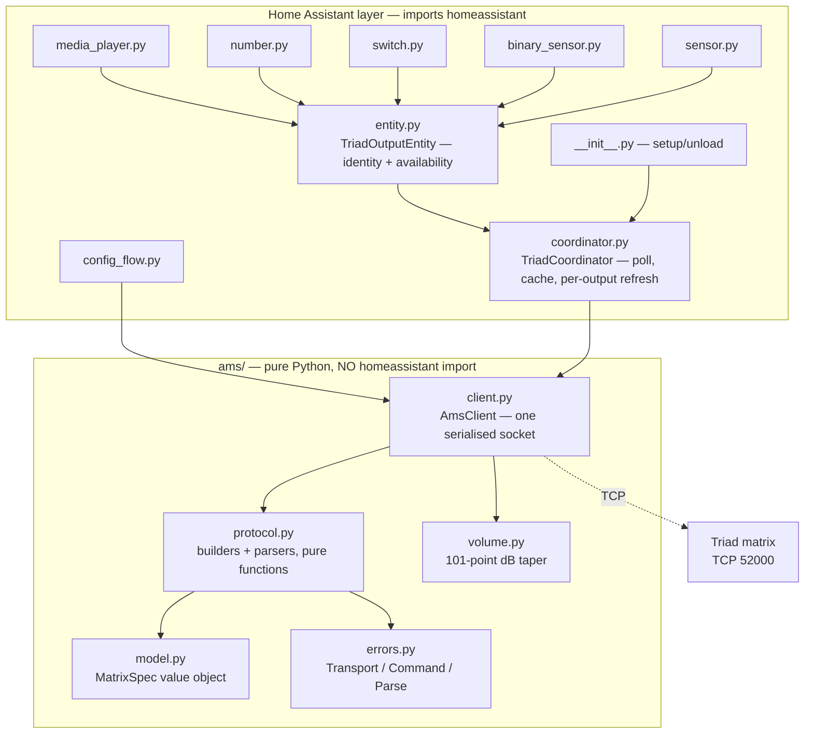

# System Design & Architecture

Requirements: [`../requirements/2026-08-28-feature-triad-ams-integration.md`](../requirements/2026-08-28-feature-triad-ams-integration.md).
Protocol reference: [`../../triad-ams-protocol.md`](../../triad-ams-protocol.md).

## Architecture Overview

Four layers, each depending only on the one below. The boundary that matters most is between
`ams/` and everything above it: **`ams/` must not import Home Assistant.** That is not a style
preference — Home Assistant cannot be imported on Windows (C-06), so this boundary is the only
reason the protocol and client are testable during development at all. `tests/conftest.py`
enforces it structurally by importing `ams` as a top-level package; adding an HA import stops the
suite collecting rather than letting it pass on a technicality.



**One config entry per matrix**, each with its own client, socket and coordinator. Nothing is
shared between matrices, which is what satisfies NFR-03: one unreachable matrix cannot stall the
other two because they have no common resource to block on.

## Data Models

### `MatrixSpec` — the model as a value object

```python
@dataclass(frozen=True, slots=True)
class MatrixSpec:
    name: str  # "AMS8" | "AMS16" | "AMS24"
    outputs: int
    inputs: int
```

**This replaces threading `output_count=` and `input_count=` through every protocol call.** The
current code passes both as keyword arguments to roughly forty functions, each re-validating the
range independently — scattered validation and a missing domain concept, in the terms of the
design review checklist. `MatrixSpec` carries them together, validates once, and gives the two
numbers a name.

It also removes a live trap. The ASG trigger opcode depends on the model — an 8×8 has no 9–16
bank, so ASG reuses that index — and today that is a bare `output_count <= 8` test at the call
site. On a `MatrixSpec` it becomes `spec.asg_index`, defined once.

### `OutputSnapshot` — what one poll learned

```python
@dataclass(frozen=True, slots=True)
class OutputSnapshot:
    source: int | None  # 1-based input, None = Audio Off
    volume_step: int  # 0..100
    muted: bool
    # Populated only when a consumer is enabled — see "Tiered polling"
    tone: ToneSnapshot | None = None
```

`source is None` **is** the off state. There is no separate per-output power concept in the
hardware, and inventing one would mean holding a flag that the device cannot confirm.

### Tiered polling

The DSP entities are disabled by default, so polling their values on every cycle would spend ~20
extra round trips per output to populate entities nobody enabled — 480 on a 24×24, against
NFR-01's requirement that a cycle fit inside its interval.

**The coordinator polls the core three attributes always, and tone/EQ only when at least one
entity consuming them is enabled.** Entities register their need at `async_added_to_hass`. This
is the one piece of coupling from entities back to the coordinator, and it is deliberate: the
alternative is either a slow poll for everyone or per-entity polling, which would break the
single-socket serialisation guarantee.

## API Design

### `ams.protocol` — pure functions

Two families, no state:

- **builders** — `set_route(spec, output, source) -> bytes`, `query_output_volume(spec, output) -> bytes`
- **parsers** — `parse_output_volume(text) -> tuple[int, float]`

Every parser returns the **output index the device named** alongside the value. That is not
decoration: it is what lets the client detect a desynchronised stream. If the device answers for
output 3 when asked about output 4, the frame boundary has slipped and the value belongs to
another zone. Returning the bare value would make that failure invisible, and unhandled frame
padding produces exactly it.

Callers speak **1-based** indices throughout; conversion to the wire's 0-based form happens in
the builders and nowhere else.

### `ams.client.AmsClient` — one socket, serialised

| Method group | Contract |
|---|---|
| `connect` / `disconnect` | Lazy connect; explicit close |
| `get_*(output)` | Query, parse, verify index, return value |
| `set_*(output, …)` | Send, consume the response frame, **discard it** |

**Writes deliberately do not parse their response.** The device does answer a write, but the
wording was never captured — the live probe was query-only, because a set command moves audio in
an occupied house. Validating against guessed strings is how a client rejects a command that in
fact succeeded, so callers needing certainty re-read instead. This is a standing decision, not a
gap to fill later.

### Error contract

| Exception | Meaning | Caller does |
|---|---|---|
| `TransportError` | Socket failed | Reconnect; coordinator raises `UpdateFailed` |
| `CommandError` | `Command error` or empty frame on a healthy socket | Retry; **keep the connection** |
| `ParseError` | Response not understood, or index mismatch | Do not retry; log |

The `CommandError` / `TransportError` split is the single most consequential decision in the
client. Real firmware emits both fault forms on healthy sockets; treating them as transport
failures produces a reconnect loop precisely under the load that provoked them.

## Component Breakdown

| Component | Responsibility | Depends on |
|---|---|---|
| `ams/model.py` | `MatrixSpec`; model table; derived indices (ASG, disconnect sentinel) | — |
| `ams/errors.py` | Three-way failure taxonomy | — |
| `ams/protocol.py` | Wire format: builders and parsers | model, errors |
| `ams/volume.py` | dB ↔ step, nearest-match | — |
| `ams/client.py` | Socket, serialisation, learned framing, reconnect | all of `ams/` |
| `coordinator.py` | Poll cadence, snapshot cache, per-output refresh | client |
| `entity.py` | Identity (`unique_id`, device info), availability | coordinator |
| `<platform>.py` | Map snapshots to entity state; map commands to client calls | entity, coordinator |
| `config_flow.py` | Setup and options; probe on add | client, model |

**Single source for the step ceiling.** `MAX_STEP` is currently defined in both `protocol.py`
(as `0x64`) and `volume.py` (as `100`) — the same number in two modules, which is a synchronised
constant waiting to drift. It belongs in `volume.py` alone, since that module owns the scale.

**`_channel_counts` and `_active_outputs` must move out of `__init__.py`.** `media_player.py`
currently imports both as private names from the package root — a leaked internal and an import
cycle risk as platforms multiply. They belong on the entry-derived config object alongside
`MatrixSpec`.

## Design Decisions

| # | Decision | Alternatives rejected | Why |
|---|---|---|---|
| D-01 | `ams/` has no Home Assistant imports | Single flat package | Enforced by C-06; also makes the protocol reusable and independently testable |
| D-02 | One serialised socket per matrix | Connection per command; connection pool | The device has no message IDs, so concurrent commands cannot be matched to answers. Per-command connections also add a handshake to all ~72 round trips of a poll |
| D-03 | Framing learned per connection | Assume single-NUL; assume padded | Both exist in this fleet's own firmware. Assuming either is silently wrong on the other |
| D-04 | Writes discard their response | Parse and validate | The response wording is unmeasured. See "Writes" above |
| D-05 | Poll, never push cached state on connect | Mirror the Control4 driver's `SyncStateToDevice` | The driver's approach is correct for the *only* controller and destructive for a second one — an HA restart would overwrite Control4's state on all 56 outputs |
| D-06 | Identity derived from `entry_id` | Host, or MAC | Reproduces the replaced integration exactly (C-02, C-07). Cleaner schemes orphan every existing entity |
| D-07 | Per-output failure keeps the previous reading | Fail the whole poll | One flaky output must not blank 24 zones |
| D-08 | Write then re-read that output only | Full refresh; optimistic update | The device may cap volume itself and another controller may have just moved the same zone. Optimistic state would show a value the device never adopted |
| D-09 | `MatrixSpec` value object | Keep threading two ints | Removes ~40 repeated parameter pairs and centralises the model-dependent ASG index |
| D-10 | Tiered polling for DSP attributes | Poll everything; per-entity polling | Poll-everything violates NFR-01; per-entity polling breaks D-02's serialisation |

## Non-Functional Requirements

| Requirement | Design response |
|---|---|
| NFR-01 — poll fits inside its interval | Serialised but pipelined-free; the drain timeout is skipped after three clean exchanges, so steady-state cost is one round trip per query. Tiered polling keeps disabled attributes off the wire |
| NFR-02 — no churn regression | Coordinator publishes snapshots; entity state derives from them. Identical readings produce identical state, and Home Assistant records no event for an unchanged state |
| NFR-03 — one matrix down affects only itself | No shared client, socket, coordinator or lock between entries |
| C-03 — no site data published | `tests/test_no_site_data.py` enumerates every tracked file rather than grepping known values; the denylist itself stays gitignored |
| C-08 — unauthenticated port | Not solvable in this layer. Recorded as accepted; the integration adds no new exposure beyond what Control4 already relies on |

### Security

There is no authentication, encryption, or authorisation in this protocol. Anything that can
reach port 52000 has full control. This integration therefore stores no secret and has nothing to
leak at runtime; its only security-relevant obligation is that **diagnostics must redact the host
and MAC**, since a diagnostics download is routinely pasted into public issue trackers.

## Requirements coverage

| Requirement | Covered by | Status |
|---|---|---|
| FR-01 routing/volume/mute/on-off | `media_player.py` | Implemented |
| FR-02 tone + EQ | `number.py` + tiered polling | Designed, not built |
| FR-03 input gain | `number.py` | Designed, not built |
| FR-04 loudness, mono-sum | `switch.py` | Designed, not built |
| FR-05 triggers | `switch.py`, `MatrixSpec.asg_index` | Designed, not built |
| FR-06 audio sense | `binary_sensor.py` under A-01/A-02 | Designed, not built |
| FR-07 grouping | — | **Withdrawn** — see below |
| FR-08 firmware, connection state | `sensor.py` | Designed, not built |
| FR-09 UI config | `config_flow.py` | Implemented |
| FR-10 HACS | `hacs.json`, CI validation | Implemented |
| FR-11 services | `services.yaml` | Designed, not built |

### FR-07 grouping — withdrawn, on evidence

FR-07 was written on a false premise. The requirement said the integration should support "the
device's native 2.1 output grouping, which Club BBQ already uses". **Club BBQ does not use it.**

Two measurements, taken during this design review:

1. **All seven groups are empty on all three matrices**, including the AMS8 that AV-03 identifies
   as running the 2.1 zone. Every one answers `Group[A..G] is empty`.
2. **The Control4 driver never calls `setOutputToGroup`.** The command constant is declared in
   `ariel_protocol.lua` and referenced nowhere in `driver.lua`. The device's group feature is
   entirely unused by the controller that configured this installation.

What Club BBQ actually runs is `SyncPairedOutput` — a **driver-side** construct. It copies volume,
mute and loudness from a master output to a slave in the driver's own data model, forces mono-sum
on the slave, and then sends ordinary per-output commands. Consistent with the reading: AMS8
outputs 1 and 2 are both `mono` at an identical `-39.7`.

**The matrix holds no record of the pairing.** It cannot be queried, so no integration can
observe it.

**Consequence for the cutover, and it is a behaviour change:** after cutover, setting Club BBQ's
volume from Home Assistant moves output 1 and leaves output 2 where it is. Under Control4 today
both move together. This is recorded in the cutover runbook.

**Decision (owner, 2026-08-28): withdraw FR-07 from this cycle.** Not deferred for lack of
design, but dropped because the thing it asked for does not exist here, and AV-03's stated remedy
is to undo the pairing and rewire that zone as true stereo. Building mirroring to preserve a
configuration already scheduled for removal is work with a short life. Revisit only if AV-03 is
abandoned, or if a device group is ever genuinely configured.

The group *commands* remain implemented in `protocol.py` and tested against the simulator. They
are correct as far as the wire format goes; what is missing is any hardware here that uses them.
